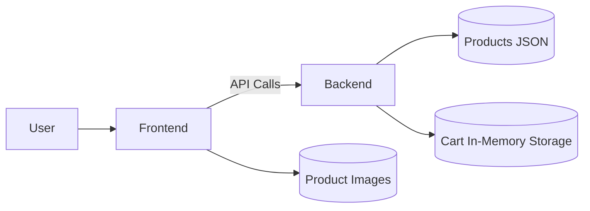

# 💎 Naksh Jewellers – Full Stack E-Commerce Application

A full-stack jewellery e-commerce web application built using **React (Frontend)** and **Node.js + Express (Backend)**.  
This project allows users to browse gold jewellery collections, add products to cart, and manage cart items.

---

## 📌 Project Overview

Naksh Jewellers is a modern jewellery storefront designed to provide a premium browsing and shopping experience. The application demonstrates frontend UI/UX development, backend API creation, state management, and containerization using Docker.

---

## 🚀 Features

### 🖥️ Frontend
- Product listing with images, name, and price
- Category filtering (Necklaces, Rings, Bangles)
- Premium jewellery themed UI
- Add to Cart functionality
- Cart page with:
  - Quantity update
  - Remove product
  - Total price calculation
- About page with brand information
- React Context API for state management
- React Router navigation

---

### ⚙️ Backend
- Express REST API
- GET products endpoint
- POST cart endpoint
- Middleware validation
- Error handling
- Environment variable configuration
- In-memory data storage (as permitted in assignment)

---

### 🐳 DevOps
- Dockerfile for frontend
- Dockerfile for backend
- Docker Compose configuration

---

## 🏗️ System Architecture



---

## 🛠️ Tech Stack

### Frontend
- React
- Vite
- React Router
- Context API
- CSS

### Backend
- Node.js
- Express.js
- CORS
- Dotenv

### DevOps
- Docker
- Docker Compose

---

## 📂 Project Structure

```
naksh-jewellers
│
├── frontend
│   ├── components
│   ├── context
│   ├── styles
│   ├── public/images
│   └── Dockerfile
│
├── backend
│   ├── routes
│   ├── middleware
│   ├── data
│   ├── server.js
│   └── Dockerfile
│
└── docker-compose.yml
```

---

## ⚙️ Installation & Setup

### 📌 Prerequisites
- Node.js
- npm
- Git
- Docker (Optional)

---

### 1️⃣ Clone Repository

```bash
git clone https://github.com/YOUR_USERNAME/naksh-jewellers.git
cd naksh-jewellers
```

---

### 2️⃣ Backend Setup

```bash
cd backend
npm install
npm start
```

Backend runs at:

```
http://localhost:5000
```

---

### 3️⃣ Frontend Setup

```bash
cd frontend
npm install
npm run dev
```

Frontend runs at:

```
http://localhost:5173
```

---

## 🐳 Docker Setup

### Build and Run Containers

```bash
docker compose up --build
```

---

## 📡 API Endpoints

### 🔹 Get Products

```
GET /api/products
```

Returns list of jewellery products.

---

### 🔹 Add Item To Cart

```
POST /api/cart
```

#### Request Body Example:

```json
{
  "id": 1,
  "name": "Gold Necklace Classic",
  "price": 55000,
  "quantity": 1
}
```

---

## 🧠 State Management

Cart state is managed using **React Context API**, allowing global cart access across components.

---

## 🔐 Environment Variables

Backend uses `.env` file.

---

## 📦 Data Storage

- Products stored in JSON file
- Cart stored in in-memory server storage  
*(As allowed by assignment requirements)*

---

## 🧪 Validation & Error Handling

- Middleware validates cart request body
- API returns appropriate HTTP status codes

---

## 📸 UI Highlights

- Jewellery themed luxury UI
- Responsive product cards
- Elegant hero banner
- Category filtering
- Styled cart interface
- Brand & About section

---

## 🎯 Assignment Requirements Coverage

| Requirement | Status |
|------------|-------------|
| Frontend UI | ✅ Completed |
| Backend APIs | ✅ Completed |
| Cart Functionality | ✅ Completed |
| Middleware Validation | ✅ Completed |
| Environment Variables | ✅ Completed |
| Docker Containerization | ✅ Completed |
| State Management | ✅ Completed |

---

## 🚀 Future Improvements

- MongoDB integration
- Checkout & payment gateway
- Authentication system
- Wishlist feature
- Order history tracking

---

## 👩‍💻 Author

**V Sanjana Devi**

---

## 📜 License

This project is created for internship assignment and educational purposes.

